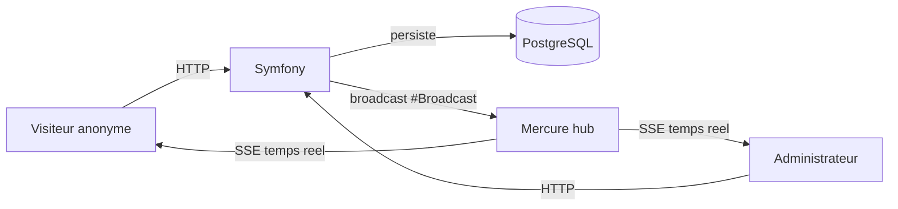

# POC Chat — Symfony UX Turbo + Mercure

Proof of concept d'une messagerie temps reel entre un visiteur anonyme et un administrateur, construite avec Symfony, Symfony UX Turbo et Mercure.

## Lancer le projet

```bash
docker compose build --pull --no-cache
docker compose up --wait
```

- Visiteur : https://localhost:8443/chat
- Admin : https://localhost:8443/admin/chat

Ports HTTP/HTTPS remappés sur 8090/8443 dans `.env` (80/443 déjà pris localement). Le schéma de base (Doctrine) n'est pas généré automatiquement — à créer manuellement.

## Architecture technique

- **Stack Docker** : image officielle `dunglas/symfony-docker` (FrankenPHP + Caddy), avec le hub **Mercure intégré nativement** comme module Caddy — pas de conteneur Mercure séparé.
- **PHP 8.5** (dernière version), **Symfony 8.1**.
- **Base de données** : PostgreSQL 16, conteneur dédié.
- **Frontend** : Symfony UX Turbo (Hotwire Turbo) + Stimulus — aucun JavaScript applicatif écrit à la main.



## Fonctionnement : room privée et temps réel

- Chaque visiteur anonyme obtient, via sa session PHP, sa propre `Conversation` en base — un fil privé avec l'administrateur.
- Les messages sont persistés (entité `Message`), puis diffusés en temps réel via l'attribut `#[Broadcast]` d'UX Turbo : chaque nouveau message déclenche une diffusion Mercure sur un topic privé (`chat_{id}`), propre à cette conversation.
- Le topic étant marqué `private`, un cookie d'autorisation JWT (limité à ce topic uniquement) est posé pour empêcher qu'un tiers s'y abonne — c'est ce qui rend la room réellement privée, sans compte utilisateur.

## Comment tester la démo

1. Ouvrir `/chat` dans un onglet — vue visiteur, une conversation privée est créée automatiquement.
2. Ouvrir `/admin/chat` dans un second onglet — liste des conversations, puis cliquer sur la conversation.
3. Écrire un message d'un côté : il apparaît **instantanément** de l'autre, sans rechargement de page.

## Limites du POC (hors périmètre)

- Aucune authentification côté admin (accès libre à `/admin/chat`).
- Pas de limitation de débit (rate limiting) sur l'envoi de messages.
- Pas de tests automatisés.
- Une conversation par session visiteur uniquement (pas de reprise multi-appareil).

## Pistes d'évolution

- Notifications (nouveau message, badge non lu).
- Historique et recherche des conversations côté admin.
- Tests automatisés (fonctionnels + broadcast Mercure).
